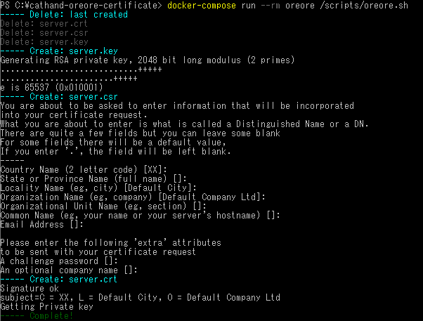

# cathand-oreore-certificate
- 【猫の手シリーズ No.001】オレオレ証明書を作るにゃ!  
  【Cat Hand Series No.001】Generate Pawsome Ore Ore Certificate!


## How to use. - 使い方

```shell script
docker-compose run --rm oreore /scripts/oreore.sh
```

- That's all.  
  これだけ。




## Requirement - 必要なもの
- [Docker](https://www.docker.com/)


## Overview - 概要
- Create an Ore Ore Certificate for your development environment.  
  開発環境用のオレオレ証明書を作成する。


### What is Ore Ore Certificate? - オレオレ証明書って何？

- "Ore Ore Certificate" = "Self Signed Certificate"  
  「オレオレ証明書」＝「自己署名証明書」

- Self-issued Suspicious certificate.  
  自分で発行した胡散臭い証明書。


### What is Ore Ore? - オレオレって何？

- The "Ore, ore!" means "It's me! It's me!"  
  「俺オレ！」は「私ワタシ！」という意味。

- It's famous for "Ore Ore Sagi".  
  「オレオレ詐欺」で有名。

- In the Japanese IT industry, It's famous for "Ore Ore certificate" and "Ore Ore framework".  
  日本のIT業界では「オレオレ証明書」「オレオレフレームワーク」で有名。


## Note - 備考

### Final Operation Confirmation Datetime - 最終更新日時
- 2020/05/09 22:00

### Operation check environment - 動作確認環境
- Microsoft Windows [Version 10.0.18363.778]
- Docker version 19.03.8, build afacb8b


## Licence - ライセンス
- Released under the [MIT License](https://opensource.org/licenses/MIT).
